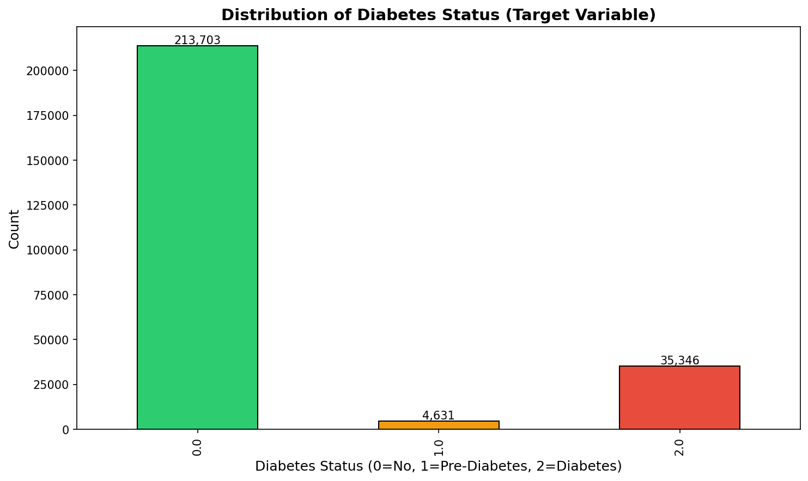
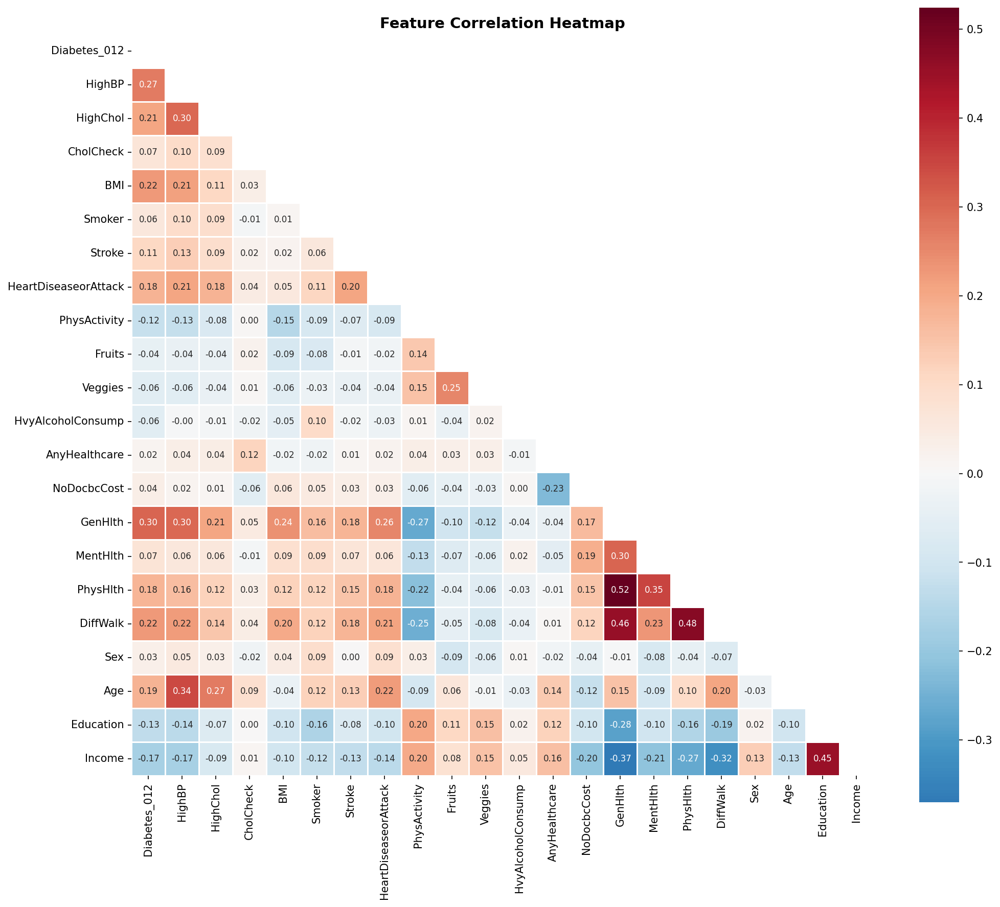

# CRISP-DM Data Mining Project Report
## Diabetes Prediction Using Unsupervised and Supervised Learning

---

## Table of Contents
1. [Phase 1: Data Understanding](#phase-1-data-understanding)
2. [Phase 2: Data Preparation](#phase-2-data-preparation)
3. [Phase 3: Unsupervised Learning (Clustering)](#phase-3-unsupervised-learning)
4. [Phase 4: Supervised Learning (Classification)](#phase-4-supervised-learning)
5. [Phase 5: Evaluation & Interpretation](#phase-5-evaluation)

---

# Phase 1: Data Understanding

## 1.1 Business Context

This project aims to develop a predictive model for diabetes diagnosis using the **CDC Diabetes Health Indicators Dataset** from the Behavioral Risk Factor Surveillance System (BRFSS). Understanding diabetes risk factors is crucial for public health interventions and early diagnosis.

## 1.2 Dataset Overview

| Property | Value |
|----------|-------|
| **Source** | CDC Behavioral Risk Factor Surveillance System (BRFSS) |
| **Rows** | 253,680 |
| **Columns** | 22 |
| **Target Variable** | `Diabetes_012` |
| **Problem Type** | Multiclass Classification (3 classes) |

### Target Variable Encoding
The target variable `Diabetes_012` represents diabetes diagnosis status:
- **0**: No Diabetes (213,703 samples, 84.2%)
- **1**: Pre-Diabetes (4,631 samples, 1.8%)
- **2**: Diabetes (35,346 samples, 13.9%)

## 1.3 Exploratory Data Analysis (EDA)

### 1.3.1 Data Quality Assessment

| Quality Check | Result | Action Required |
|--------------|--------|-----------------|
| **Missing Values** | None detected | No imputation needed ✓ |
| **Duplicate Rows** | 23,899 (9.42%) | Consider removal |
| **Data Types** | All float64 | Consistent ✓ |

### 1.3.2 Feature Classification

The dataset contains 21 predictor features categorized as follows:

| Feature Type | Count | Examples |
|-------------|-------|----------|
| **Binary** | 14 | HighBP, HighChol, Smoker, Stroke, PhysActivity |
| **Ordinal** | 4 | GenHlth (1-5), Education (1-6), Income (1-8), Diabetes_012 |
| **Continuous** | 4 | BMI, MentHlth (0-30 days), PhysHlth (0-30 days), Age (1-13 categories) |

### 1.3.3 Class Imbalance Analysis



**Critical Finding**: The dataset exhibits **severe class imbalance**:
- Class 0 dominates with 84.2% of samples
- Class 1 (Pre-Diabetes) represents only 1.8%
- Imbalance ratio: **46:1** (Class 0 vs Class 1)

**Implications for Modeling**:
1. Models may be biased toward the majority class
2. Standard accuracy metrics will be misleading
3. **Recommendation**: Use stratified sampling and consider class weights

### 1.3.4 Correlation Analysis



**Top Features Correlated with Diabetes**:

| Feature | Correlation | Interpretation |
|---------|-------------|----------------|
| GenHlth | +0.30 | Poor general health correlates with higher diabetes risk |
| HighBP | +0.27 | High blood pressure is a strong indicator |
| BMI | +0.22 | Higher BMI associated with diabetes |
| DiffWalk | +0.22 | Difficulty walking indicates higher risk |
| HighChol | +0.21 | Cholesterol levels correlate with diabetes |
| Income | -0.17 | **Negative**: Higher income → lower risk |
| Education | -0.13 | **Negative**: Higher education → lower risk |

**Multicollinearity Check**:
- Only one pair with |r| > 0.5: `GenHlth ↔ PhysHlth` (r = 0.52)
- Low multicollinearity overall, which is favorable for modeling

### 1.3.5 Outlier Detection (IQR Method)

| Feature | Outliers (%) | Valid Range |
|---------|--------------|-------------|
| BMI | 3.88% | [13.5, 41.5] |
| MentHlth | 14.27% | [-3.0, 5.0] |
| PhysHlth | 16.14% | [-4.5, 7.5] |
| Age | 0.00% | [0, 16] |

**Note**: MentHlth and PhysHlth outliers are expected as they represent extreme (but valid) health conditions.

## 1.4 Key Findings & Rationale

### Why These Findings Matter

1. **No Missing Values**: Eliminates the need for imputation strategies, simplifying preprocessing.

2. **Duplicate Removal Decision**: 
   - 9.42% duplicates could represent data collection artifacts
   - **Recommendation**: Remove to prevent data leakage and ensure generalization

3. **Class Imbalance Strategy**:
   - Since Pre-Diabetes (Class 1) is severely underrepresented
   - **Decision**: Consider binary classification (Diabetes vs No Diabetes) by combining classes 1 and 2
   - This increases the minority class from 13.9% to 15.7%

4. **Feature Scaling Necessity**:
   - Features have different scales (BMI: 12-98, Age: 1-13, Binary: 0-1)
   - Required for distance-based algorithms (KNN, SVM, K-Means)
   - **Method**: StandardScaler (z-score normalization)

## 1.5 Visualizations Generated

| File | Description |
|------|-------------|
| `figures/01_target_distribution.png` | Bar chart of class distribution |
| `figures/02_correlation_heatmap.png` | Feature correlation matrix |
| `figures/03_feature_distributions.png` | Histograms by diabetes status |
| `figures/04_boxplots.png` | Box plots of numerical features |
| `figures/05_target_correlation.png` | Feature importance by correlation |

## 1.6 Code Implementation

The Phase 1 analysis was implemented in [`data_understanding.py`](data_understanding.py), which includes:
- Data loading and inspection
- Statistical summary generation
- Missing value and duplicate detection
- Feature type classification
- Outlier detection using IQR method
- Correlation analysis
- Automated visualization generation

---

*End of Phase 1 - Proceed to [Phase 2: Data Preparation](#phase-2-data-preparation)*

---

# Phase 2: Data Preparation

## 2.1 Overview

This phase transforms the raw dataset into a format suitable for machine learning algorithms. Key transformations include duplicate removal, target variable conversion, feature scaling, and train/test splitting.

## 2.2 Data Transformations

### 2.2.1 Duplicate Removal

| Metric | Value |
|--------|-------|
| Duplicates Found | 23,899 (9.42%) |
| Rows After Removal | 229,781 |
| Reduction | 9.42% |

**Rationale**: Duplicates may represent data collection artifacts or survey errors. Keeping them could:
1. Lead to **data leakage** during cross-validation
2. Inflate certain patterns, **biasing the model**
3. Violate the independence assumption of machine learning algorithms

### 2.2.2 Binary Classification Conversion

The 3-class target variable was converted to binary classification:

| Original Class | Count | % | → | Binary Class | Count | % |
|---------------|-------|---|---|--------------|-------|---|
| 0 (No Diabetes) | 190,055 | 82.71% | → | 0 (No Diabetes) | 190,055 | 82.71% |
| 1 (Pre-Diabetes) | 4,629 | 2.01% | → | 1 (Diabetes/Pre) | 39,726 | 17.29% |
| 2 (Diabetes) | 35,097 | 15.27% | ↗ | ↑ Combined | | |

**Imbalance Improvement**: 46:1 → **4.78:1**

**Rationale for Conversion**:
1. Pre-diabetes class (2.01%) is too small for reliable predictions
2. Clinically, both pre-diabetes and diabetes require medical intervention
3. Binary classification is more practical for real-world deployment
4. Significantly reduces class imbalance problem

### 2.2.3 Feature Scaling (StandardScaler)

Applied z-score normalization: `z = (x - μ) / σ`

| Feature | Original Range | Scaled Range |
|---------|---------------|--------------|
| BMI | [12.0, 98.0] | [-2.46, 10.21] |
| Age | [1.0, 13.0] | [-2.29, 1.59] |
| MentHlth | [0.0, 30.0] | [-0.45, 3.45] |
| PhysHlth | [0.0, 30.0] | [-0.52, 2.80] |
| Income | [1.0, 8.0] | [-2.33, 1.01] |

**Why StandardScaler over MinMaxScaler?**

| Scaler | Pros | Cons | Suitability |
|--------|------|------|-------------|
| **StandardScaler** | Robust to outliers; Centers data around 0 | Doesn't guarantee bounded range | ✅ **Chosen** |
| MinMaxScaler | Bounded [0,1] range | Sensitive to outliers; Compresses data | ❌ Not suitable |

Our data contains outliers in BMI, MentHlth, and PhysHlth. MinMaxScaler would compress the majority of data points due to extreme values.

**Critical**: Scaler was **fit on training data only**, then applied to test data. This prevents **data leakage**.

### 2.2.4 Train/Test Split

| Set | Samples | Percentage | Class 0 | Class 1 |
|-----|---------|------------|---------|---------|
| Training | 183,824 | 80% | 82.71% | 17.29% |
| Test | 45,957 | 20% | 82.71% | 17.29% |

**Stratified Sampling**: Ensures identical class proportions in both sets, critical for imbalanced datasets.

### 2.2.5 Why 80/20 Instead of 80/10/10?

A common question in machine learning is whether to use:
- **80/20 split** (Train/Test)
- **80/10/10 split** (Train/Validation/Test)

We chose **80/20** because we use **GridSearchCV** for hyperparameter tuning, which performs **internal k-fold cross-validation** on the training set.

```
┌─────────────────────────────────────────────────────────────────────┐
│                    Original Dataset (229,781)                       │
├─────────────────────────────────────┬───────────────────────────────┤
│         Training Set (80%)          │        Test Set (20%)         │
│            183,824 samples          │        45,957 samples         │
├─────────────────────────────────────┼───────────────────────────────┤
│   GridSearchCV Internal 5-Fold CV:  │                               │
│   ┌─────┬─────┬─────┬─────┬─────┐   │   Held out for FINAL          │
│   │Fold1│Fold2│Fold3│Fold4│Fold5│   │   evaluation only             │
│   │ Val │Train│Train│Train│Train│   │   (never seen during tuning)  │
│   └─────┴─────┴─────┴─────┴─────┘   │                               │
└─────────────────────────────────────┴───────────────────────────────┘
```

**How GridSearchCV Works**:
1. For each hyperparameter combination, splits training data into k folds (default: 5)
2. Trains on k-1 folds, validates on the remaining fold
3. Rotates through all folds, averaging validation scores
4. Selects the hyperparameters with the best average validation score
5. Final model is retrained on the **entire training set** with optimal parameters

**Advantages over a separate validation set**:
- More robust: Uses all training data for both training and validation
- Reduces variance: Averages across multiple validation folds
- No need for additional data split, maximising training data

## 2.3 Output Files

```
prepared_data/
├── X_train_scaled.csv      # Scaled training features
├── X_test_scaled.csv       # Scaled test features
├── X_train_unscaled.csv    # Unscaled training features (for Random Forest)
├── X_test_unscaled.csv     # Unscaled test features
├── y_train.csv             # Training labels
├── y_test.csv              # Test labels
├── standard_scaler.pkl     # Saved scaler for deployment
└── feature_names.csv       # Feature column names
```

## 2.4 Code Implementation

The Phase 2 analysis was implemented in [`data_preparation.py`](data_preparation.py), which includes:
- Duplicate detection and removal
- Binary target conversion
- Stratified train/test splitting
- StandardScaler normalization
- Data export for subsequent phases

---

*End of Phase 2 - Proceed to [Phase 3: Unsupervised Learning](#phase-3-unsupervised-learning)*
